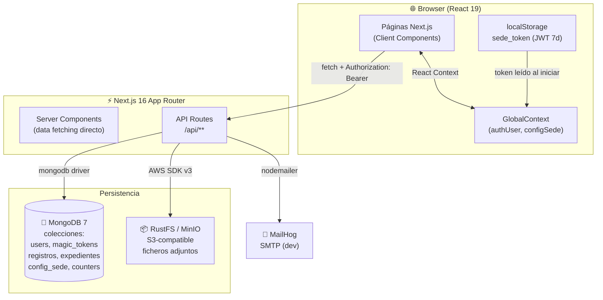
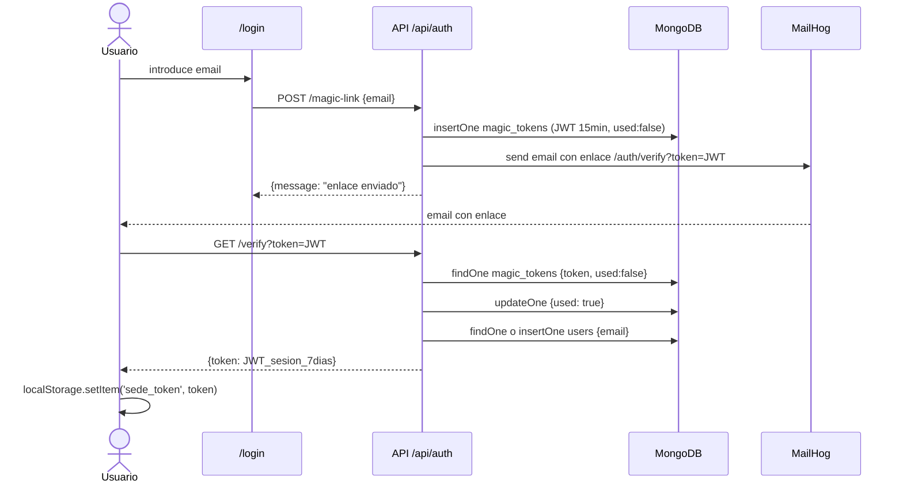
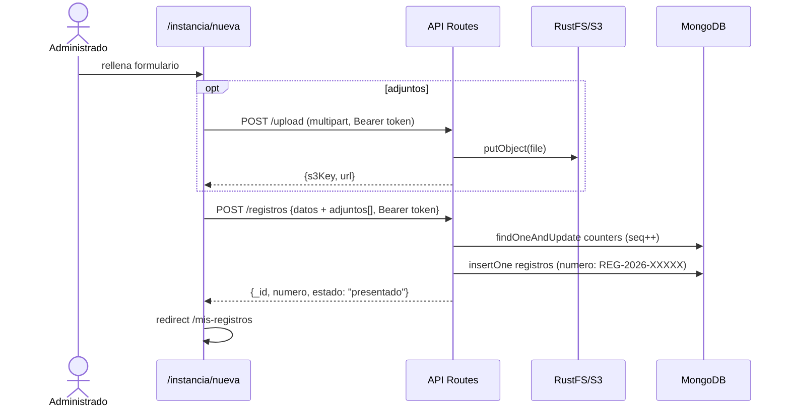
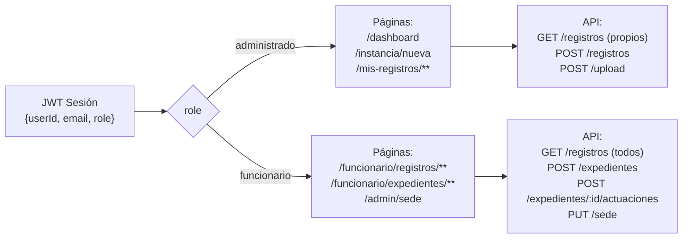

# Arquitectura — Sede Electrónica Ayuntamientos

## Diagrama de Componentes (C4 Container Level)

## Flujo de Autenticación — Magic Link

## Flujo de Presentación de Instancia

## Modelo de Roles y Acceso

## Estructura de Capas

| Capa | Responsabilidad | Archivos |
|---|---|---|
| **UI / Presentación** | Renderizado, interacción usuario | `app/**/page.tsx`, `components/` |
| **Estado Global** | Auth + configSede compartidos | `context/GlobalContext.tsx`, `hooks/` |
| **API / Controladores** | Validación, autorización, coordinación | `app/api/**/route.ts` |
| **Dominio / Lógica** | JWT, numeración, tipos | `lib/auth.ts`, `lib/registro-numero.ts`, `lib/expediente-codigo.ts`, `lib/types.ts` |
| **Infraestructura** | Acceso a servicios externos | `lib/db.ts`, `lib/s3.ts`, `lib/mail.ts` |
