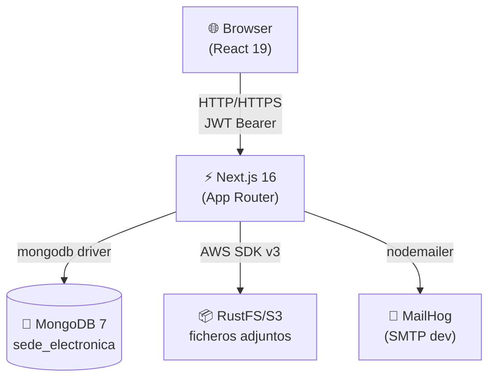
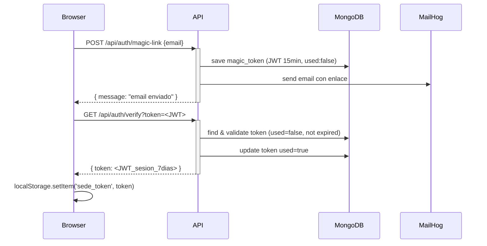
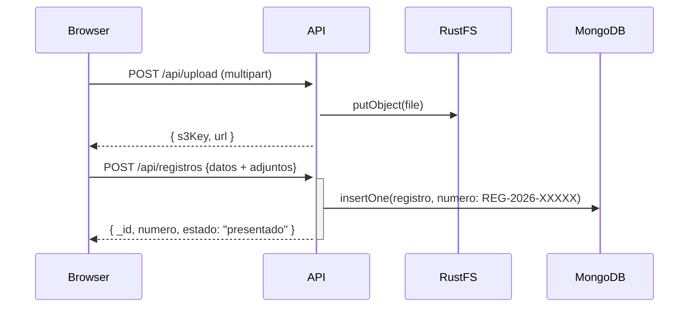

@~/.claude/prompts/new_functionality_prompt_spec.md

# Crear Diagrama de Arquitectura — Sede Electrónica Ayuntamientos

## Role
Act as a Software Architect expert in documenting distributed systems with Mermaid diagrams.

## Context
Proyecto: Sede Electrónica — Next.js 16 / React 19 / TypeScript / MongoDB  
Ruta: `D:\Master-IA-Dev\04-Bloque4\1-4-150-ayuntamientos\ayuntamientos`  

Stack tecnológico:
- Frontend/Backend: Next.js 16 App Router (Server Components + API Routes)
- Base de datos: MongoDB 7 (colecciones: users, magic_tokens, registros, expedientes, config_sede)
- Storage: RustFS/MinIO (S3-compatible) para ficheros adjuntos
- Email: MailHog + Nodemailer para magic links
- Auth: JWT stateless (magic token 15min + session token 7días) en localStorage
- Estado global: React Context (GlobalContext)
- Roles: administrado | funcionario

Flujos principales:
1. Magic Link Auth: Browser → /api/auth/magic-link → MongoDB (save token) → MailHog → Browser → /api/auth/verify → JWT session
2. Presentar Instancia: Browser → /api/registros POST → MongoDB; adjuntos → /api/upload → RustFS
3. Gestión Funcionario: Browser → /api/expedientes → MongoDB

## Task
Crear un diagrama de arquitectura en formato Mermaid que muestre los componentes del sistema y los flujos principales. Guardar en `docs/architecture.md` e integrar en el README.

### Diagrama Guidelines

**Diagrama 1: Arquitectura de Componentes (C4 Container Level)**

**Diagrama 2: Flujo de Autenticación Magic Link**

**Diagrama 3: Flujo de Presentación de Instancia**

### Archivo `docs/architecture.md`
Crear archivo con los tres diagramas y descripción de cada componente.

### README Guidelines
Añadir sección "Arquitectura" justo después de la descripción general con:
- Referencia a `docs/architecture.md`
- El diagrama de componentes embebido directamente

## Output format
- `docs/architecture.md` con los tres diagramas Mermaid
- `README.md` actualizado con sección "Arquitectura" y diagrama de componentes

## Examples and Steps to Follow
1. Crear rama `feat/architecture-diagram`
2. Crear `docs/` directory si no existe
3. Crear `docs/architecture.md` con los tres diagramas
4. Actualizar README con sección "Arquitectura"
5. Verificar que los diagramas renderizan correctamente en GitHub
6. Commit y PR

## Output Checklist and Guardrails
- [ ] `docs/architecture.md` existe con mínimo 2 diagramas Mermaid
- [ ] README tiene sección "Arquitectura" con al menos 1 diagrama
- [ ] Los diagramas usan sintaxis Mermaid válida (verificar en mermaid.live)
- [ ] Los diagramas reflejan la arquitectura REAL del proyecto (no genérica)
- [ ] Los nombres de componentes coinciden con los del código
